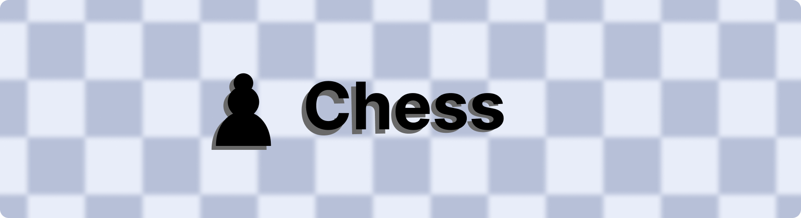

<h1 align="center">Chess (with no additional features) </h1>

  

Yup. It's just chess. No additional features. Just chess. I know what you're thinking. "Why would I want to play chess with no additional features?" Well, I don't know. Maybe you're a purist. Maybe you're a minimalist. Maybe you like the idea of playing chess with no additional features. Maybe you're just bored.

The real question you should be asking yourself is "Why do I have so much time on my hands that I'm reading the README for a chess game with no additional features?" To which I would respond, "I don't know. Why do you?"

